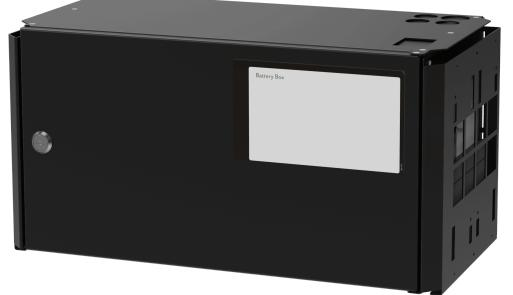

# PRODUKTBLAD - STRÖMFÖRSÖRJNING FRÅN MILLETEKNIK

## Namn, artikelnummer och e-nummer

| Namn                         | Artikelnummer   | E-nummer |
|------------------------------|-----------------|----------|
| UPS Battery Box 24V FLX M | FM01U000024BB01 | 5213665  |

## Produktbild

# Benämning

Batteribox för två 45 Ah batterier.

## Användningsområde

Används för att utöka reservdriftstiden hos strömförsörjning / batteribackup.

# Batteri och batterityp

Två 20 Ah batterier.

Två 45 Ah batterier.

Batterityp: 12 V, AGM blysyra batteri, underhållsfritt. Batterier ingår ej.

## Kapsling, utförande

Plåtskåp för väggmontering eller i 19" rackskåp (5 HE). Pulverlackat svart. Fyra kabelgenomföringar på ovansidan och utslagshål på baksidan. Buntbandshållare i kapsling.

| Mått, höjd x bredd x djup | IP-klass |
|---------------------------|----------|
| 224 x 437 x 212 mm        | IP32     |

#### Vikt

| Namn                        | Nettovikt | Vikt m förp. |
|-----------------------------|-----------|--------------|
| Batteribox UPS 24V FLX M | 6,57 kg   | 7,3 kg       |

#### Installationskrav

Enheten är avsedd för fast installation. Enheten skall installeras inomhus, miljöklass 1, omgivningstemperatur: +5°C – 40°C. Rekommenderad omgivningstemperatur är +15°C - 25°C.

## Passar till

| Produktserie | Kapslingsstorlek | Antal |
|--------------|------------------|-------|
| SINUS UPS    | FLX M            | 1     |
| SINUS UPS    | FLX L            | 1     |

# Krav som produkten uppfyller

| EMC:  | EMC Direktivet 2014/30EU                                                                                                |
|-------|-------------------------------------------------------------------------------------------------------------------------|
| El:   | Lågspänningsdirektivet: 2014/35/EU                                                                                      |
| CE:   | CE direktivet enligt:765/2008                                                                                           |
| Miljö | REACH Regulation: Directive 1907/2006, WEEE Regulation: Directive 20021961E, RoHS Regula tion: Directive 2015/863 |
|       |                                                                                                                         |

# Garanti

Produkten har två års garanti för tillverkningsfel.

Tillverkning, livslängd, miljöpåverkan och återvinning

Tillverkad av Milleteknik i Partille, Sverige.

Produkten konstrueras för lång livslängd vilket minskar miljöpåverkan. Uttjänta produkter lämnas till närmaste återvinningscentral.

#### Länk till senaste informationen

Produkter är föremål för uppdateringar, du hittar alltid den senaste informationen på [www.milletek](https://www.milleteknik.se/)[nik.se](https://www.milleteknik.se/).

## [Batteriboxar & batterihyllor](https://www.milleteknik.se/produkt-kategori/batteriboxar-batterihyllor/)

## [Sinus UPS](https://www.milleteknik.se/produkt-kategori/ups/)

#### Om dessa uppgifter

Alla uppgifter publiceras med reservation för eventuella fel. Uppdateras utan föregående meddelande.