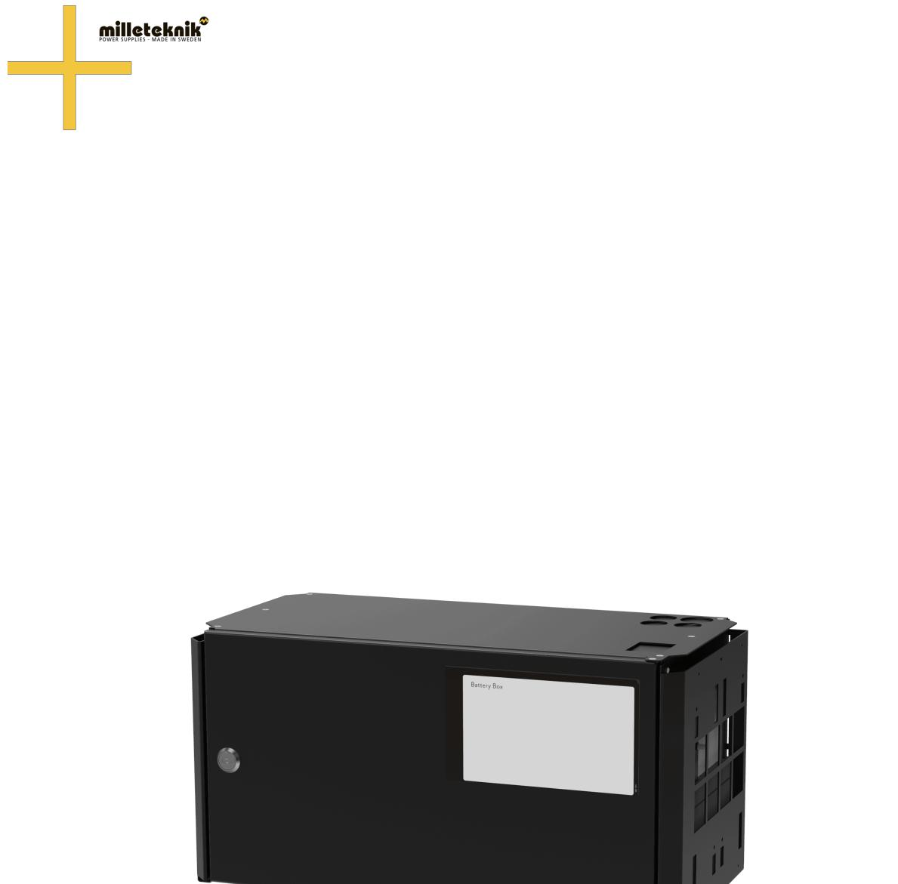
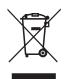
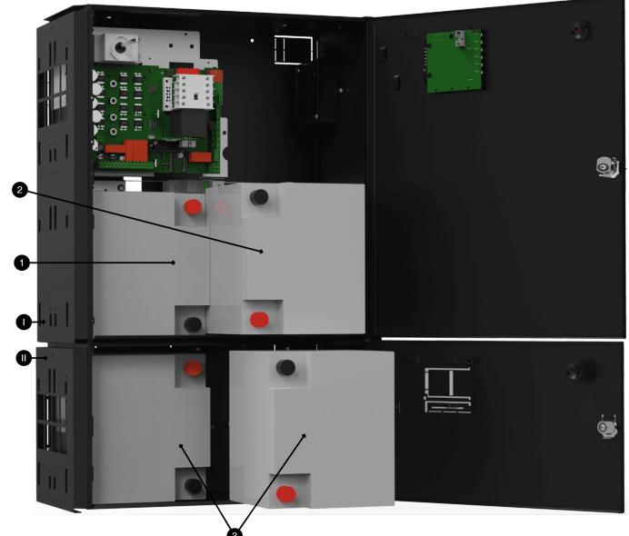
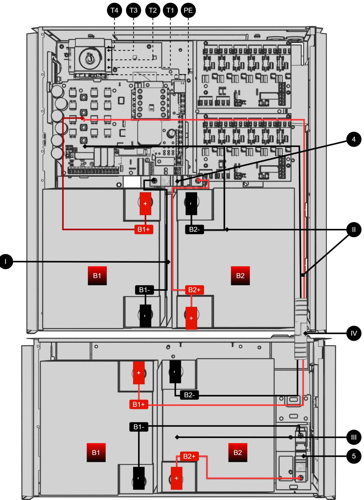
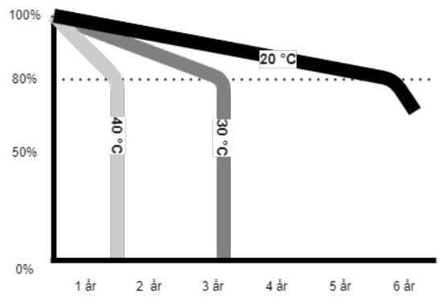

SV

# UPS Battery Box 24 V FLX M

350-230 Publiceringsdatum 2023-03-09

# **Innehållsförteckning**

| 1. Om UPS batteribox  3                                     |  |
|-------------------------------------------------------------|--|
| 1.1. Tillverkarens support  3                               |  |
| 1.2. Produktens livslängd, miljöpåverkan och återvinning  3 |  |
| 2. Denna batteribox passar till följande UPS:er  4          |  |
| 3. Batterier - placering och inkoppling  4                  |  |
| 3.1. Placering av batterier  4                              |  |
| 3.2. Inkoppling batteribox med UPS  5                       |  |
| 4. Tekniska data UPS  6                                     |  |
| 5. Tekniska data kapsling  6                                |  |
| 5.1. Kapsling - Tekniska Data -UPS Battery box 24V FLX M  6 |  |
| 6. Batterier  7                                             |  |
| 6.1. Batterier ingår ej  7                                  |  |
| 6.2. 45 Ah, 12 V AGM-batteri  7                             |  |
| 7. Underhåll  7                                             |  |
| 7.1. Batterier  7                                           |  |
| 7.2. Batteribyte  8                                         |  |
| 7.3. Batteriåtervinning  8                                  |  |

# 1. OM UPS BATTERIBOX

Batteriboxen är gjord för två 45 Ah batterier och kan kopplas till UPS i FLX L kapsling. S[eDenna](#page-3-0) [batteribox passar till följande UPS:er \[4\]](#page-3-0) UPS:er denna batteribox passar till.

#### 1.1. Tillverkarens support

Tillverkare ger support under produktens livslängd, dock som längst 10 år efter inköpsdatum. Byte till likvärdig produkt kan förekomma om tillverkare bedömer att reparation inte är möjlig. Kostnader för support tillkommer efter det att garantitiden har gått ut.

## 1.2. Produktens livslängd, miljöpåverkan och återvinning

Produkten är designad och konstruerad för lång livslängd vilket minskar miljöpåverkan. Produktens livslängd (förutom slitagedelar) är beroende på, bland annat miljöfaktorer, främst omgivningstemperatur, oförutsedd belastning på komponenter som blixtnedslag, yttre åverkan, handhavandefel, med flera. Produkter återvinns genom att lämnas till närmaste återvinningsstation eller sändas åter till tillverkare. Kontakta din distributör för mer information. Kostnader som uppkommer i samband med återvinning ersätts ej.

# 2. DENNA BATTERIBOX PASSAR TILL FÖLJANDE UPS:ER

| UPS                             | Artikelnummer  |
|---------------------------------|----------------|
| SIN 600W FLX L                  | FL01U0021FP006 |
| SIN 1100W FLX L                 | FL01U0031FP011 |
| SIN 1500W FLX L                 | FL01U0031FP015 |
| TEL-1200W-STS-SIN2*             | 5144           |
| *Säljs ej direkt av Milleteknik |                |

# 3. BATTERIER - PLACERING OCH INKOPPLING

### 3.1. Placering av batterier

| Nr | Förklaring                                                        |
|----|-------------------------------------------------------------------|
| 1  | Skjut in första batteriet (I).                                    |
| 2  | Skjut in andra batteriet (I).                                     |
| 3  | I batteribox (II) sätts batterier in på samma sätt som i UPS (I). |

## 3.2. Inkoppling batteribox med UPS

Bilden ger även en översikt över kopplingar för batterikablar och batterisäkringar.

|  |  |  |  | Tabell 1. Översikt inkommande elnät och batterinkoppling |
|--|--|--|--|----------------------------------------------------------|
|--|--|--|--|----------------------------------------------------------|

| Nr / bokstav | Förklaring                                                                                      |
|--------------|-------------------------------------------------------------------------------------------------|
| I, III       | Batterikablage till automatsäkring.                                                             |
| II           | Batterikablage från moderkort.                                                                  |
| IV           | Batterikablage, på truckhandske, från batteribox, skall kopplas med mötande truckhandske i UPS. |
| 4,5          | Batterisäkring (automatsäkring)                                                                 |
| T3           | Intern nödstopp.                                                                                |
| T2           | FAS elnät, inkommande.                                                                          |
| T1           | Nolla elnät, inkommande.                                                                        |
| PE           | Inkommande skyddsjord.                                                                          |

#### Tabell 2. Batterinummer

| B1, B2 | Förklaring                                  |
|--------|---------------------------------------------|
| B1+    | + från kretskort/truckhandske till batteri  |
| B1-    | - från säkring till batteri.                |
| B2+    | + från säkring till batteri.                |
| B2-    | - från kretskort/truckhandske till batteri. |

## 4. TEKNISKA DATA UPS

| Systemspänning:   | 24 V.                |
|-------------------|----------------------|
| Batterityp:       | AGM-blysyra.         |
| Kapsling:         | Pulverlackad plåt.   |
| Montering:        | Vägg eller 19" rack. |
| Tillverkningsland | Sverige              |

## 5. TEKNISKA DATA KAPSLING

## 5.1. Kapsling - Tekniska Data -UPS Battery box 24V FLX M

| Info                      | Förklaring                                                       |  |  |
|---------------------------|------------------------------------------------------------------|--|--|
| Namn                      | FLX M                                                            |  |  |
| Kapslingsklass            | IP 32                                                            |  |  |
| Mått                      | Höjd: 224 mm, bredd 438 mm, djup 212 mm                          |  |  |
| Höjdenheter               | 5 HE                                                             |  |  |
| Montering                 | Vägg eller 19" rack.                                             |  |  |
| Omgivningstemperatur      | +5 °C - +40 °C. För bästa batteri-livslängd: +15 °C till +25 °C. |  |  |
| Omgivning                 | Miljöklass 1, inomhus. 20% ~ 90% relativ fuktighet               |  |  |
| Material                  | Pulverlackerad plåt.                                             |  |  |
| Färg                      | Svart                                                            |  |  |
| Kabelgenomföringar, antal | 4 Knockout för truckhandske                                      |  |  |

Batterier som får plats

**Info Förklaring**

2 stycken 12 V, 45 Ah.

# 6. BATTERIER

## 6.1. Batterier ingår ej

Batterier säljs separat.

## 6.2. 45 Ah, 12 V AGM-batteri

| Batterityp                            | V    | Ah    |
|---------------------------------------|------|-------|
| Underhållsfritt AGM, blysyra-batteri. | 12 V | 45 Ah |

#### Tabell 3. 10+ Design life* batteri

| Artikelnummer  | E-nummer | Artikelnamn                                  | Termi nal | Mått. Höjd, bredd, djup | Vikt per styck | Fabrikat |
|----------------|----------|----------------------------------------------|--------------|----------------------------|-------------------|----------|
| MT113-12V45-01 | 5230546  | UPLUS 12V 45Ah 10+ Design life batteri | M6 Bult      | 197x165x170 mm             | 14,5 kg           | UPLUS    |

*Design life är hållbarheten i år för ej använt batteri. Omgivningsfaktorer som värme och last påverkar livslängden. Batterier som har en hållbarhet (+10 Design Life) på 10+ år brukar behöva bytas efter 4-5 år.

# 7. UNDERHÅLL

Systemet, med undantag för fläkt och batterier, är underhållsfritt vid installation i inomhusmiljö.

Kontrollera fläkten årligen. Fläkten skall rotera problemfritt utan missljud. Rengör fläkten ifrån damm och smuts. Fläkten skall bytas om den inte roterar problemfritt eller är så smutsig att den inte kan rengöras helt. Om fläkten inte fungera bra kommer luftflödet i enheten att hindras vilket leder till att värmen ökar i kapslingen, vilket kan leda till att batterikapaciteten försämras och att bytesintervall på batterier avsevärt förkortas.

#### 7.1. Batterier

Batterier alstrar elektricitet genom en kemisk process och det sker därmed en naturlig degradering av kapacitet. Den största faktorn för batteriers livslängd är temperatur. Ju högre temperatur desto kortare livslängd på batterier. En ideal temperatur är 20 °C. Tillverkningsdatum som är präglat på batteriet och livslängden (som batteritillverkaren anger) gäller vid ej utnyttjat batteri. Således varierar faktisk livslängd när det används. Batterier bör bytas efter halva angiven (från batteritillverkaren) livslängd för säker drift. Batterier inköpta via batteribackupens tillverkare har en livslängd (från batteritillverkaren) på mellan 10-12 år med rekommenderat byte efter 5-6 år.

## 7.2. Batteribyte

- Bryt, om möjligt, nätspänning vid batteribyte.
- Koppla bort batterikablar. Notera hur batterikablar är monterade innan de avlägsnas.
- Tag bort batterisäkring mellan batterier.
- Sätt in fast de nya batterierna.
- Anslut batterikablarna på samma sätt som tidigare.
- Sätt fast batterisäkring mellan batterier.
- Slå till nätspänning. Eventuellt kan indikeringsdioden lysa för låg batterispänning / nätbortfall tills batterier är laddade. Det kan ta upp till 72 timmar innan batterierna är fulladdade.
- För att systemet skall mäta in nya batteriers kapacitet behöver enheten rensa tidigare batterikapacitet. Dip-switch 8 gör en mjukvaru-reset som bland annat nollställer larm. Se Återställning av data efter batteribyte, Dip-switch 8
- Testa systemet genom att kortvarigt koppla bort nätspänning, (= lasten skall drivas vidare av batterierna), och därefter slå till nätspänningen igen.

#### 7.3. Batteriåtervinning

Alla batterier skall återvinnas. Återlämna till tillverkare eller lämna till återvinningsstation.

